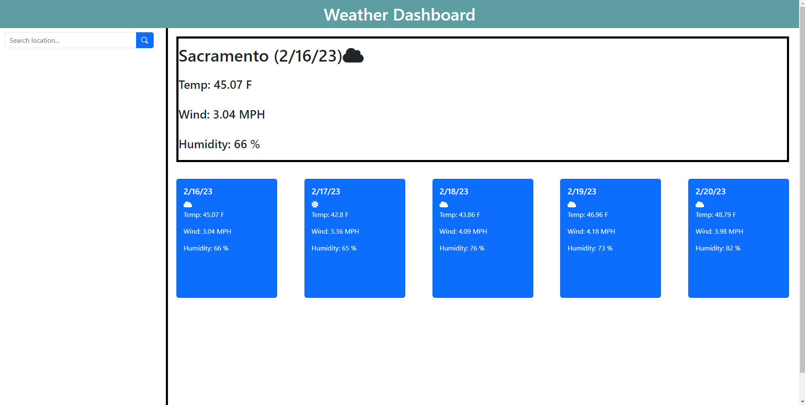
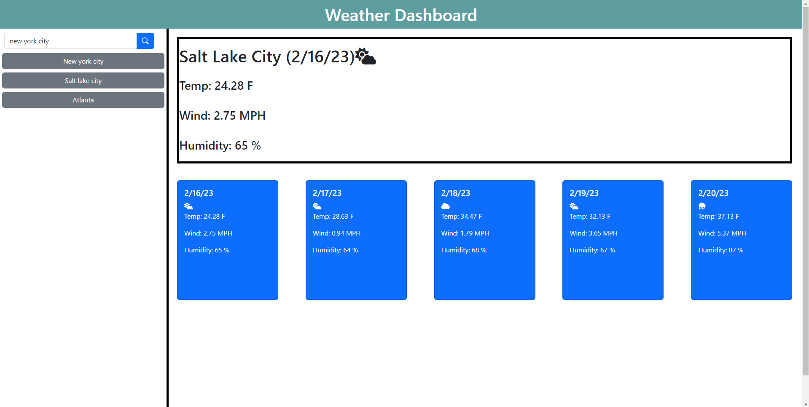

# Weather Dashboard

## Description
A weather dashboard that can take user inputted cities and display current forecasted weather conditions (up to 5 days). The webpage utilizes the OpenWeather API to provide weather information for a specified location. The webpage also uses OpenWeathers Geolocation API to accurately grab the user's specified location. This project demonstrates the utility of server-side APIs as well as brushes up on past concepts that were learned throughout the course such as basic HTML/CSS techniques, the use of the Bootstrap CSS framework, as well as several handy javascript practices such as event listeners, DOM manipulation, and the fetch API.

## Installation
N/A

## Usage
Upon visiting the webpage, the current forecasted weather will be defaulted to Sacramento, CA. Using the search bar, the user can click the search button or press 'Enter' to call a search for the specified city. The Geolocation API will (to the best of its ability) try to accurately grab the correct location depending on what the user inputted and grab the coordinates for the location so that the weather API can grab and display the weather conditions. The current day's weather conditions will be displayed in the large box while the 5-day forecast will be displayed in the blue cards below. Currently, the name of the city, an icon representing the weather condition, the temperature, wind speed, and humidity level are displayed. Searching a location will add a button below the search bar that can be referenced later on to re-visit a location's weather conditions.

The webpage should look like the following:

## Credits
N/A

## License
N/A